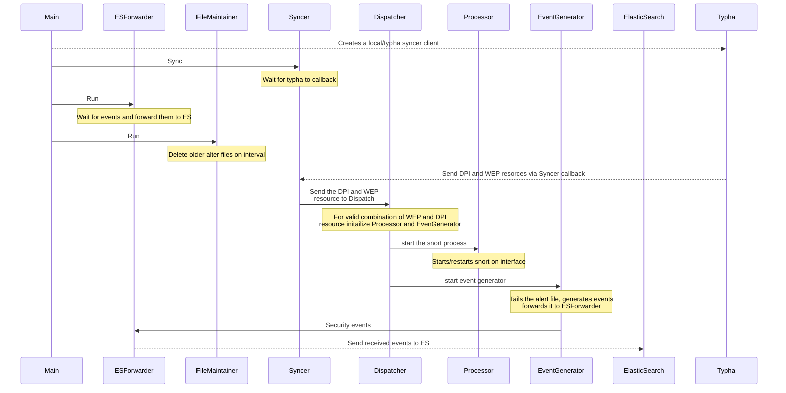

# deep-packet-inspection

It starts a typha client to get updates on DeepPacketInspection and WorkloadEndPoint resources required by tigera-dpi daemonset.
Starts a snort process for each WEP that matches the selector in DeepPacketInspection resource.

## Building and testing

To build this locally, use one of the following commands:

```
make image
```

or

```
make ci
```

## Adding and running test

To run all tests

```
make fv ut
```

FV test runs against real k8s, they should be added to the GINKGO_FOCUS variable in Makefile.

## Testing snort with local rules for development

To trigger snort alert during development, one option is to use custom snort rules.

Running snort with custom rules:
- Create and populate `local.rules` file, below is sample rule that alerts on any ICMP request
```
alert icmp any any -> any any ( sid:1000005; rev:1;)
``` 
- Copy the `local.rules` file to docker image by adding this line in Dockerfile.snort.amd64
```
# Copy local rules for dev testing
COPY local.rules /usr/local/etc/rules/
```
- Pass the local rules file when setting snort command line in `/pkg/exec/snort_exec.go` like below
```go
    exec.Command(
    "snort",
    ....
    "-R", "/usr/local/etc/rules/local.rules",
    )
```

## Debug logs
Set environment variable `DPI_LOG_LEVEL` with value `debug`

## Update Snort3 version

To update the Snort3 version used for DPI, update the version number assigned to the variable `SNORT3_VERSION` in Makefile.

## Code flow




