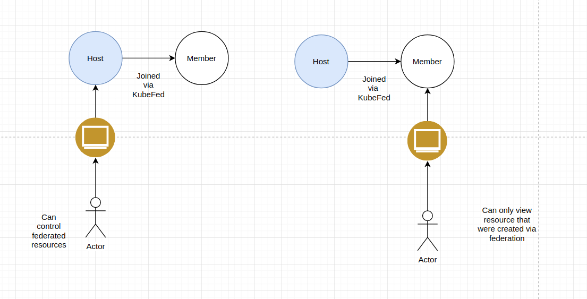

>**Warning**: This feature is experimental.  Experimental features may change significantly or become unsupported in future releases.”
{: .alert .alert-danger} 
### Big picture

Create federated tiers and policies that apply across clusters or a group of clusters.

### Value

If you plan to deploy multiple clusters, federating tiers and policies can extend your security controls to existing and new clusters. This reduces duplication of policies (and maintenance of identical policies per cluster), simplifying the creation and maintenance of your security controls.

### Features

This how-to guide uses the following {{site.prodname}} features:

- Tier

### Concepts

#### Federation tools
One way to achieve federation with Calico Enterprise tiers and policies is to use [KubeFed](https://github.com/kubernetes-sigs/kubefed), which allows you to configure multiple Kubernetes clusters from a single set of APIs in a host cluster. You need to determine which Calico Enterprise cluster will be the host cluster, and the member clusters.

- _Host cluster_ 
 
   The host cluster runs the Kubernetes control plane and propagates all resources. It can also be a member cluster.
- _Member cluster_ 

   Member cluster can join the control plane if authenticated, and can access resources as permitted.

As for permissions, host cluster users have full control over the federated resources (such as network policies and tiers) subject to RBAC. Member cluster users can only view the resources that were created via federation.



#### Implementing federation on Calico Enterprise clusters
 
If you have a Calico Enterprise clusters that are not connected, you can:

 ```
- Configure one cluster as a KubeFed host
- Configure federating APIs and RBAC for KubeFed
- Turn on feature flag in Calico Enterprise Manager 
```

### Before you begin...

- Calico Enterprise standalone clusters (or multi-clustered management (MCM) clusters). For help, see the [Quick Start quide]({{site.baseurl}}/getting-started/kubernetes/quickstart#install-kubernetes) or [ Set up multi-cluster management]({{site.baseurl}}/reference/beta/mcm/installation).
- kubectl is installed
- You have configured access to the Calico Enterprise Manager
- Helm is installed
- You have experience configuring Calico Enterprise [tiered policies]({{site.baseurl}}/security/tiered-policy)

### How To

1. [Install KubeFed and CLIs](#install-kubefed-and-clis)
2. [Register clusters](#register-clusters)
3. [Enable federation of APIs](#enable-federation-of-apis)
4. [Configure RBAC for federation](#configure-rbac-for-federation)
5. [Enable federation in Calico Enterprise Manager](#enable-federation-in-calico-enterprise-manager)
6. [Manage federated resources in Calico Enterprise Manager](#manage-federated-resources-in-calico-enterprise-manager)

#### Install KubeFed and CLIs

The first step is to deploy KubeFed on the host cluster and KubeFed CLI locally. KubeFed is installed as a Helm chart. Follow the steps from the installation guide for [KubeFed](https://github.com/kubernetes-sigs/kubefed/blob/master/charts/kubefed/README.md)

>**Note**. You should see the following two charts. Regardless of the output shown, you still need kubefed-charts/kubefed-0.1.0-rc6 to install kubefed V2.
{: .alert .alert-info}
```
helm search kubefed
NAME                        	CHART VERSION	APP VERSION	DESCRIPTION                        
kubefed-charts/kubefed      	0.1.0-rc6    	           	KubeFed helm chart                 
kubefed-charts/federation-v2	0.0.10       	           	Kubernetes Federation V2 helm chart
```


Make sure you have installed [kubefedctl](https://github.com/kubernetes-sigs/kubefed/blob/cfdc37323e8540a814e5c1d88b453b84b327cfd1/docs/installation.md#kubefedctl-cli).

#### Register clusters

To register the host and the member clusters, specify both the role -_-cluster-context_ and the control plane using _--host-cluster-context_. For help, see [cluster registration](https://github.com/kubernetes-sigs/kubefed/blob/master/docs/cluster-registration.md)

```
kubefedctl join host --cluster-context host \
--host-cluster-context host --v=2
kubefedctl join member --cluster-context member \
--host-cluster-context host --v=2
```

The two clusters will join the federation as long as they are discoverable. The host cluster issues health checks to determine if a member cluster is up and running. The host cluster issues health checks to the API server of the member cluster.

#### Enable Federation of APIs

Run the following command on the host cluster to enable federation for Kubernetes and Calico APIs.

```
kubefedctl enable tiers.crd.projectcalico.org
kubefedctl enable networkpolicies.crd.projectcalico.org
kubefedctl enable globalnetworkpolicies.crd.projectcalico.org
kubefedctl enable stagedglobalnetworkpolicies.crd.projectcalico.org
kubefedctl enable stagedkubernetesnetworkpolicies.crd.projectcalico.org
kubefedctl enable stagednetworkpolicies.crd.projectcalico.org
```

Run the following command on the **host cluster** to enable Kubernetes API for network policies.

```
kubefedctl enable networkpolicies.networking.k8s.io --federated-group networkpolicies.networking.k8s.io
```

Run the following command on the **host cluster** to add get, create, list, delete operations to the _kubefed_ clusterrole.

```
kubectl patch clusterrole kubefed-role --type='json' -p='[{"op": "add", "path": "/rules/1", "value": {
"apiGroups": [
"networkpolicies.networking.k8s.io"
],
"resources": [
"*"
],
"verbs": [
"get",
"watch",
"list",
"update"
]
}
}]'
```

If you are running older versions of Kubernetes (< 1.16), make sure to use networkpolicies.extensions as an API group.

```
kubefedctl enable networkpolicies.extensions --federated-group networkpolicies.extensions
kubectl patch clusterrole kubefed-role --type='json' -p='[{"op": "add", "path": "/rules/1", "value": {
"apiGroups": [
"networkpolicies.extensions"
],
"resources": [
"*"
],
"verbs": [
"get",
"watch",
"list",
"update"
]
}
}]'
```

#### Configure RBAC for Federation

Run the following command on the host cluster to allow kubefed-controller to monitor and propagate federated resources.

```
cat <<EOF | kubectl apply -f -
apiVersion: rbac.authorization.k8s.io/v1
kind: ClusterRole
metadata:
  name: kubefed-controller-role
rules:
- apiGroups: [""]
  resources: ["namespaces"]
  verbs: ["get", "watch", "list"]
- apiGroups: [""]
  resources: ["events"]
  verbs: ["get", "watch", "list", "create"]
- apiGroups: ["core.kubefed.io"]
  resources: ["*"]
  verbs: ["get", "watch", "list", "update", "create", delete]
- apiGroups: ["multiclusterdns.kubefed.io"]
  resources: ["*"]
  verbs: ["get", "watch", "list"]
- apiGroups: ["scheduling.kubefed.io"]
  resources: ["*"]
  verbs: ["get", "watch", "list"]
- apiGroups: ["types.kubefed.io"]
  resources: ["*"]
  verbs: ["get", "watch", "list", "create", "delete", "update"]
- apiGroups: ["networkpolicies.k8s.io"]
  resources: ["federatednetworkpolicies"]
  verbs: ["get", "watch", "list", "create", "delete"]
EOF
```

```
kubectl create clusterrolebinding binding-kubefed-controller --clusterrole kubefed-controller-role --serviceaccount kube-federation-system:kubefed-controller
```

Run the following command on the host cluster to allow the service account you are using to log in into Calico Enterprise Manager to get, create, and delete network policies.

```
cat <<EOF | kubectl apply -f -
apiVersion: rbac.authorization.k8s.io/v1
kind: ClusterRole
metadata:
  name: kubefed-ui-user
rules:
- apiGroups: ["core.kubefed.io"]
  resources: ["kubefedclusters"]
  verbs: ["get", "watch", "list"]
- apiGroups: ["types.kubefed.io"]
  resources: ["*"]
  verbs: ["get", "watch", "list", "create", "delete", "update"]
- apiGroups: ["networkpolicies.k8s.io"]
  resources: ["federatednetworkpolicies"]
  verbs: ["get", "watch", "list", "create", "delete", "update"]
EOF
```

```
kubectl create clusterrolebinding clusterrole-kubefed-binding-ui-user --clusterrole kubefed-ui-user --serviceaccount default:ui-user
```

#### Enable federation in Calico Enterprise Manager

Run the  following command from the host cluster to enable the enriched UI for federation

```
kubectl patch deployment -n tigera-manager tigera-manager --patch \
'{"metadata": {"annotations": {"unsupported.operator.tigera.io/ignore": "true"}}, "spec":{"template":{"spec":{"containers":[{"name":"tigera-manager","env":[{"name": "ENABLE_FEDERATED_CLUSTER_MANAGEMENT", "value": "true"}]}]}}}}'
```

#### Manage federated resources in Calico Enterprise Manager

With federation configured, all you need to do is create **federated tiers and network policies** in Calico Enterprise Manager. You manage federated resources in Calico Enterprise Manager alongside non-federated resources. They use the same CI/CD workflow of create, preview, and stage.


Here are a few differences and limitations to note:

- Federated resources can only be created on a host cluster. 
- Editing and deleting are disabled for member clusters.
- The UI does not display propagation status if creation/deletion/edit succeeds on the member clusters.
- A network policy acts in the scope of a single cluster; operations between clusters is not enforced.
- There is no cross-cluster statistics or metrics display -- only cluster-level metrics. For example, there are no cross-cluster global reports, flow charts, policy preview, or federated policy metrics.

##### Create a federated tier

Specifying a federated policy is done simply by selecting the radio button, **Federated**. As with non-federated tiers, you enforce the ordering for federated resources to ensure its consistency across clusters. In addition to this, you select the placement of the federated tier. You can only select clusters that have been previously joined as part of federation.


##### Create a network policy

To create a federated network policy, add a new policy to any tiers. You can define Ingress and Egress rules as normal, and they are applied to pods based on label selectors.


In order to create a namespace network policy, you must select from a list of federated namespaces. Ensure that your namespace is federated.

```
kubefedctl federate namespace federated-namespace
```
